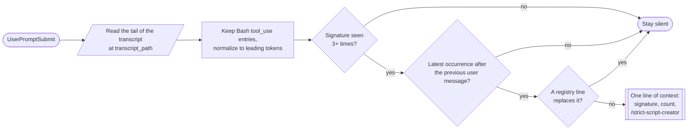
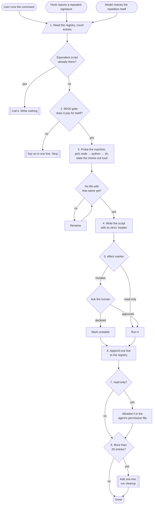
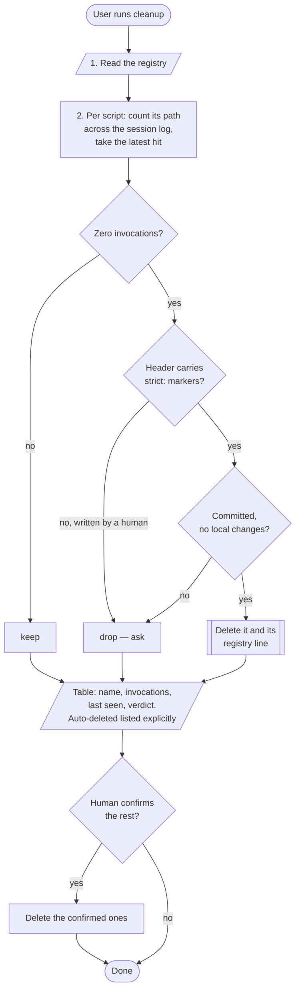

# strict-script-creator — design

Date: 2026-08-04
Status: superseded in part on 2026-08-05 — see below
Branch: `feat/strict-script-creator`

## Superseded: detection and registry

The detection design below — normalizing Bash commands to a signature, speaking on the third
repetition, suppressing through a registry `replaces:` field — was built and then replaced. A
parser reads token positions; it cannot read the intent behind an argument, and every case it
missed (chains, `cd`, quoting) added another heuristic.

What shipped instead: a `SessionStart` hook loads the script catalog into context once per
session, and a `UserPromptSubmit` hook counts tool calls carrying an executable payload —
input under `command`, `code`, or `script` — and past a threshold invites the model to look at
its own turn. The model judges whether those commands were one routine. The registry lost
`replaces:` and gained `skip:` lines for routines the 80/20 gate rejected.

Read `strict-script-creator/README.md` for the shipped design. Everything below stands as the
2026-08-04 record, and the sections on the create flow, the run gate, cleanup, and artifact
placement still describe what the skill does.

## Problem

Routine work repeats. The model re-derives the same sequence of steps every time — demo
setup, test scaffolding, fixtures, environment preparation — burning tokens and producing a
slightly different result on each run.

A script does not have this problem. It is deterministic, cheap to run, readable, and a
human can run it by hand. The goal is to notice the routine, turn it into a script once, and
reuse it from then on. Scripts compose the way page objects compose in tests: a short call
replaces a long improvised sequence.

The intent is a multiplier. Each script makes the next task cheaper, and scripts calling
scripts compound that effect. The trade is explicit: 20% of the effort for 80% of the
impact. A script that does not pay for itself must not be written.

Writing scripts freely creates the opposite problem — a folder of a thousand scripts of
which ten are used. So the skill owns both ends: it creates scripts and it removes the ones
nothing calls.

## Scope

In scope for v1:

- One skill with two modes: `create` and `cleanup`.
- One hook that notices repetition and surfaces a candidate.
- A flat registry so any agent knows which scripts already exist.
- A run gate separating read-only scripts from mutating ones.
- A repository-wide artifact storage rule in `CLAUDE.md` (already applied).

Out of scope for v1, deliberately deferred:

- Promoting a script into a skill.
- Handing a script over to `cli-creator` to become a CLI plus a companion skill.
- Packaging a cluster of scripts and skills as a plugin.
- Detecting routines from non-`Bash` tool calls.
- Any staleness model beyond "nothing ever called it".

## Where a script ends up

A script is the first form, not the final one. This skill owns that first form: routines local
to one repository, living in its tree, run from its root. A script that proves itself has two
ways out, and the flow's job is to name the exit rather than quietly outgrow the folder.

Two questions decide the form, and they are separate. First: is this still a script, or has it
become a tool? Second: if it is a tool, what teaches an agent to use it?

**Script or CLI** — the reach and complexity of the routine:

| Signal | Form |
|---|---|
| Repeated actions inside one repository, reproduced verbatim each time | Script — v1 |
| Needed from any repository, outlives this project, has its own commands, config, or auth | CLI on `PATH` — `cli-creator` |

`cli-creator` draws the same line from its side: "If a short script in the current repo solves
the task, write the script there instead."

**What wraps the CLI** — a bare CLI on `PATH` is invisible to an agent until something explains
when to reach for it:

| Signal | Wrapper |
|---|---|
| One tool, one usage story | Companion skill |
| A domain: several commands or scripts, plus hooks, agents, or slash commands shipped together | Plugin — the richer composite, versioned and distributed as one unit |

So the ladder runs script → CLI → CLI paired with a skill, or with a plugin when the domain has
grown past one usage story. Every rung past the first is a future step; v1 only recognizes the
signal, names the rung, and stops. Nothing is converted in place — the script stays as the
working prototype, already running, already carrying a header, already counted. That is what
makes the promotion decision evidence-based rather than speculative.

## Agent neutrality

The skill states capabilities, never mechanisms. It says "count invocations from the session
log, when one is reachable" — not "read `~/.claude/projects/*/*.jsonl`". Vendor knowledge is
data, held in one binding table at
[references/agent-bindings.md](https://github.com/Viperwow/strict-ai/blob/main/strict-script-creator/skills/strict-script-creator/references/agent-bindings.md):

| Agent | Detect | Session log | Proactive event | Permission file |
|---|---|---|---|---|
| Claude Code | `$CLAUDE_PLUGIN_ROOT`, or `~/.claude` exists | `~/.claude/projects/*/*.jsonl` | `UserPromptSubmit` | `.claude/settings.local.json` |
| anything else | no row matched | — | — | — |

A new agent is a new row. The body of `SKILL.md` never changes for it.

Behaviour degrades in two steps, and the skill names the step it is on:

1. **Session log reachable** — repetition detection, invocation counts, autonomous removal.
2. **No session log** — whether the agent is unknown or simply has no log, the outcome is the
   same: create and cleanup both work, usage cannot be measured, so autonomous removal is off
   and every candidate goes to the human.

Neither step breaks the skill; only the automation differs. The hook is one of three entry points,
never a dependency: without it the user and the model still open the same flow.

While this stays a four-row table it belongs in the skill's `references/`. If it grows logic
rather than rows, it moves to `strict-adapters`.

## Reuse before doing

Creating scripts is worthless if nothing calls them. One rule carries the whole payoff, and it
belongs in `SKILL.md` as its own section:

> Before performing a multi-step routine by hand, read `.strict-ai/scripts/README.md`. If a
> listed script covers it, run that script instead. Reuse beats reproduction.

The registry is one flat file, so the check costs a single read. It is the same read create
step 1 performs, for the same reason: the cheapest script is the one already written.

## Entry points

Three ways a routine becomes a script. All three converge on the same create flow:

1. The user invokes `/strict-script-creator` with a description.
2. The hook reports that a command signature repeated, and the model acts on it.
3. The model notices the repetition itself and proposes automation.

## Artifacts

Repository (`strict-script-creator` — its own plugin, so the hook ships only with the skill that owns it):

```text
strict-script-creator/
  skills/strict-script-creator/SKILL.md
  skills/strict-script-creator/references/agent-bindings.md
  hooks/hooks.json
  hooks/detect-routine.mjs
```

This is the first hook in the repository, and the reason the skill gets a package of its own: a
hook runs whether or not anyone asked for it, so shipping it inside a shared package would force
it on everyone who installed that package for a different skill. Every plugin in the wild that
ships hooks is single-purpose for the same reason. Three files outside the package change with
it, per guardrail 12 in `CLAUDE.md`: `marketplace.json` lists the plugin, `README.md` records its
availability, and `CLAUDE.md` adds the package row.

Target project, created on first use:

```text
.strict-ai/scripts/
  README.md        # registry, one line per script
  <name>.<ext>     # the scripts themselves
```

The registry is created by create step 6 when it is missing: a one-line title and nothing else.
Script names are kebab-case, matching the rest of the repository.

No other state is written anywhere. Script metadata lives in the script header. Call history
lives in the session log named by the binding table. This follows the Artifact storage rule in
`CLAUDE.md`.

## Detection hook

The hook is the Claude Code binding of the proactive entry point, per the binding table. Its
event is `UserPromptSubmit`: it fires once per user prompt, which is cheap, and it receives
`transcript_path` on stdin, so no separate log has to be maintained. An agent with no such
event simply has no hook, and the other two entry points carry the flow.

Behaviour:

1. Read the tail of the transcript JSONL (last ~200 entries).
2. Keep `tool_use` entries for `Bash`.
3. Normalize each command to a signature: leading tokens up to the first one that starts with
   `-` or contains `/`, capped at three. Two tokens are not enough — `npm run build` and
   `npm run lint` would collapse into one signature and the suggestion would name nothing.
4. Speak only when the signature occurs 3 or more times, its latest occurrence falls after the
   previous user message, and no registry line `replaces` it. Then emit one line of additional
   context naming the signature, its count, and `/strict-script-creator`.

The middle condition is what keeps the hook from nagging. Without it, three calls made ten
prompts ago stay in the window and the same line is emitted on every prompt for the rest of the
session. With it, the hook speaks on the turn the routine actually repeated — including three
repetitions inside a single turn, which is the common case when the model loops on the same
command.



The hook never blocks, never prompts, and never writes. It is advisory.

Accepted ceilings, to be revisited only if they cause real friction:

- `Bash` only — other tools are not inspected.
- Current session only — no cross-session history.
- A signature may be suggested more than once in a session, since suppression would require
  state.

## Create flow

| Step | Action | Gate |
|---|---|---|
| 1 | Read `.strict-ai/scripts/README.md` and count its entries. Does an equivalent script exist? | Exists → call it, write nothing |
| 2 | Apply the 80/20 gate: repetitions times manual steps against the cost of the script | Fails → say so in one line, stop |
| 3 | Probe the machine, pick the runtime, state the choice in one sentence, check the name against the folder | File exists → rename |
| 4 | Write `.strict-ai/scripts/<name>` with its header | Always allowed, no confirmation |
| 5 | Run the script once to verify it works | `read-only` → run it; `mutates` → ask first |
| 6 | Append one line to the registry, creating it if absent | — |
| 7 | `read-only` only: allowlist the script in the agent's permission file | `mutates` → never allowlisted |
| 8 | If step 1 counted more than 20 entries, append one reminder line about `cleanup` | — |

**Step 5, when the run does not pass.** Two repair attempts. Still failing on the third — or
declined by the human, so it never ran at all — the file stays on disk and its registry line
is marked `unstable`. Silently keeping a broken script is worse than not writing one.

The mark is a label, not a verdict. It does not by itself make a script removable: cleanup
still decides on invocations, and a script that later starts working accumulates them. What
the mark does is keep the script in view — cleanup lists it among the candidates it shows the
human, and whoever confirms it works removes the mark by hand.

**Step 7 is what makes the automation pay off in practice.** A script invoked twenty times a
day behind a confirmation prompt costs twenty clicks; the token saving survives, the friction
saving does not.

The entry names one exact script, never the folder: `"Bash(node .strict-ai/scripts/demo-report.mjs:*)"`.
A folder-wide pattern such as `"Bash(node .strict-ai/scripts/:*)"` would pre-approve every file
that lands there afterwards, including `mutates` scripts written later — that is the run gate
deleting itself. One line per `read-only` script, and a `mutates` script is never allowlisted
at all.

The file comes from the binding table. Under Claude Code that is `.claude/settings.local.json`,
not `.claude/settings.json`: permissions granted by automation are personal and untracked, not
something that arrives in a teammate's checkout through a merge.

Writing it is a merge, never a write: read the existing JSON, append one entry to the
permissions array, keep every other key untouched. The file belongs to the user and holds
settings this skill knows nothing about.



Writing a script is never gated, regardless of what the script does. Only execution is gated.
A script that is never run costs nothing and is removed later by `cleanup`.

Step 8 is the only cleanup trigger. There is no schedule and no background process: the
pressure to stay clean appears exactly when the folder grows.

## Script header

Every script carries a shebang and three marker lines:

```javascript
#!/usr/bin/env node
// strict:purpose  Bring up the demo stack with seed data.
// strict:effect   mutates
// strict:usage    node .strict-ai/scripts/demo-setup.mjs [--reset]
```

The shebang is the single source of truth for the runtime; no marker repeats it.

`strict:effect` is declared at creation time, never inferred from the code at call time. The
presence of these markers also tells `cleanup` that the mechanism created this file rather
than a human.

## Registry

`.strict-ai/scripts/README.md`, one line per script. The name links the way every link in this
repository does — path as the text, URL as the target — so the line works in a checkout and in
a browser alike:

```markdown
- [`.strict-ai/scripts/demo-setup.mjs`](https://github.com/<owner>/<repo>/blob/main/.strict-ai/scripts/demo-setup.mjs) — brings up the demo stack with seed data. run: `node .strict-ai/scripts/demo-setup.mjs`. replaces: `docker compose up`. effect: mutates.
```

Flat markdown serves both readers: an agent reads it to learn what to call, a human reads it
to learn what exists. There is no index format beyond this line.

`replaces` carries the command signature the script took over. Without it the hook cannot tell
that a routine is already automated — it searches for `docker compose up`, and every other
field spells the script's own path instead. The field is what makes the hook's silence
condition implementable.

A script whose verification run did not pass carries a trailing `unstable.` on the same line.

The URL is built from `git remote get-url origin` at write time. No remote, or a remote that is
not a browsable host, means a plain path and no link — never a guessed URL.

## Run gate

Before running any script from the registry, read its `effect`:

- `read-only` — run it without asking.
- `mutates` — ask for confirmation first.

## Runtime selection

The runtime is chosen from what the machine has and what the task needs. The project's own
language is not a factor: a Python repository may never be executed at all.

1. Probe once per script creation, in a single call that cannot fail:

   ```bash
   command -v node python3 pwsh sh || true
   ```

   The choice is recorded nowhere: the file extension and the shebang state it, and the probe
   is one call when it is needed again.

2. Default priority among what is available: **node → python → POSIX sh**. Node leads because
   it starts fast and handles JSON and files without dependencies; add `citty` only when the
   script genuinely needs flags or subcommands.
3. The task overrides the priority: data parsing where a Python library already fits goes to
   Python; a thin wrapper over existing CLI commands goes to `sh`.
4. State the choice in one sentence before writing the file — which runtime, why, and what the
   probe found. A silent pick is unreviewable.

Name collisions are checked twice before writing: against the registry, and against the folder
itself, so an existing file is never silently overwritten. The two checks catch different
failures — a script can sit on disk without a registry line after a hand edit or a bad merge,
and a registry line can outlive a deleted file. Shadowing a real shell command is not among the
risks: scripts are invoked by full path, never by bare name.

Output format is the script's own business, with one rule: a script other scripts call prints
machine-readable output. A script only a human reads may print whatever is clearest.

## Cleanup flow

Usage is counted from native data, not from a counter of our own. The session log named by the
binding table persists on disk across sessions, and a script is invoked by a literal path, so
the number of times a script ran is the number of times its path appears in that log. When the
table has no log for the current agent, cleanup drops to degradation step 2: it still reports,
but every candidate goes to the human.

Scope: only the current project's sessions are read, and all script names are matched in one
pass rather than one pass per script. Scripts are local to their repository, so other projects'
sessions cannot contain them, and scanning every session on the machine would cost hundreds of
megabytes to learn nothing. A routine that genuinely spans repositories is a CLI, and leaves
this skill by the ladder above.

| Step | Action |
|---|---|
| 1 | Read the registry |
| 2 | For each script, count occurrences of its path across the session log and take the most recent one |
| 3 | Classify each script (see below) |
| 4 | Delete what qualifies for autonomous removal, together with its registry line |
| 5 | Show the full table and ask about everything else |



The gate mirrors the create flow. There, the irreversible act is running a script, so writing
is free and running is gated. Here, the irreversible act is losing something git cannot bring
back, so the git state decides.

**Removed autonomously** when it was never useful and losing it costs nothing. Both halves must
hold:

- never useful: zero invocations in the session log. Every script is run once at creation, so
  zero means it never even passed verification — not that it is needed rarely. A script used
  once a year still carries that first invocation;
- costs nothing: the header carries `strict:*` markers, so the mechanism wrote it, and the file
  is committed with no local changes, so a revert is one command.

**Goes to the human** — everything else: at least one invocation, no markers, uncommitted
changes, recently modified, or marked `unstable`.

The report is the same either way: name, invocations, last seen, verdict (`keep` / `drop`).
Files removed autonomously are listed explicitly, so removal is visible rather than
discovered later.

Accepted ceiling: a script the user runs by hand in their own terminal never appears in the
session log and lands among the candidates. That is why deletion outside the three conditions
always asks, and why the git condition exists at all.

## Composition

Scripts call each other as ordinary shell commands. The registry is the table of contents.
There is no runner, no framework, and no plugin system for scripts.

## Errors and verification

A script exits non-zero and prints one line to stderr on failure. The verification run in
create step 5 is the test; no separate test suite is created for generated scripts.

The hook is the only real code in this design and gets one runnable check: a fixture
transcript with a signature repeated three times, asserting the hook names it, plus one where
the signature is already in the registry, asserting silence.

## Future steps

- Convert a proven script into a skill, so it triggers by description rather than by an
  explicit call. Likely a second, optional skill in the same plugin.
- Hand a proven script over to `cli-creator`, so it becomes a CLI on `PATH` plus a companion
  skill. The script stays the prototype; the conversion is a separate, deliberate act.
- Package a cluster of related scripts and skills as a plugin, once they share a domain and
  need hooks or agents shipped alongside them.
- Cross-session detection in the hook, if single-session detection proves too narrow.

Every promotion consumes what v1 already produces: a script that runs, a header that declares
its effect, and a usage count from the session log. That is what makes the decision to promote
evidence-based rather than speculative.

The two thresholds in this design — three repetitions before the hook speaks, twenty registry
entries before cleanup is suggested — are guesses. They are named here so they can be tuned
against real use rather than defended as design.
