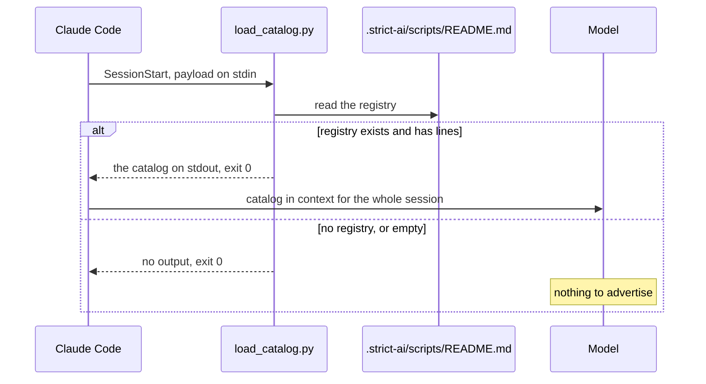
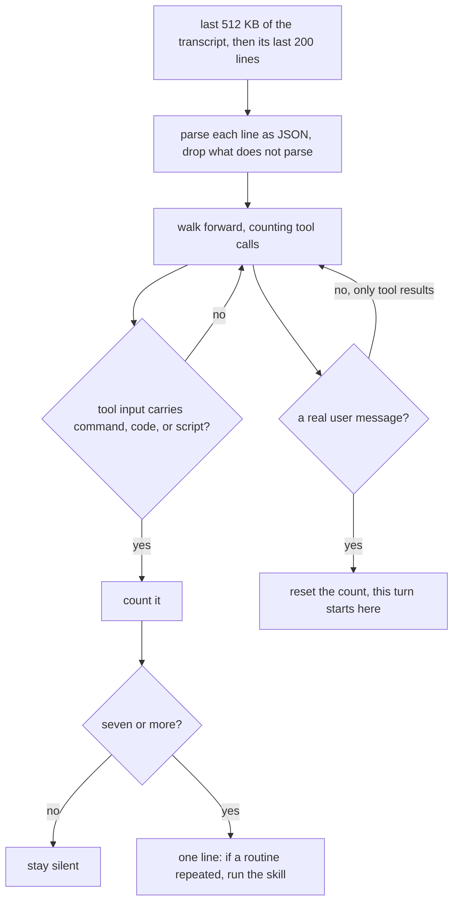

# strict-script-creator

Turns a repeated routine into a reusable script under `.strict-ai/scripts/`, reuses it, and removes what nothing calls.

The skill is [skills/strict-script-creator/SKILL.md](https://github.com/Viperwow/strict-ai/blob/main/strict-script-creator/skills/strict-script-creator/SKILL.md). This file describes the scripts in `hooks/` — what runs, when, and on what evidence.

## Two hooks, one division of labour

Neither hook decides anything about your code. One supplies memory, the other supplies a prompt to look; the judgment stays with the model, which is the only party that knows what the commands were for.

| Hook | Event | Cost | Answers |
|---|---|---|---|
| `load_catalog.py` | `SessionStart` | one read, once per session | what exists, what is already automated, what was deliberately left alone |
| `detect_routine.py` | `UserPromptSubmit` | silent unless the turn was command-heavy | was this turn mechanical enough to be worth a second look |

The split follows what each layer can actually see. A counter sees one turn, so it catches repetition *inside* a turn. The catalog persists across sessions, so it catches a routine repeated *between* them. Everything slower than that — the demo you rebuild by hand every other week — is caught by the person, who says so.

## Session start: the catalog



Long registries are capped at 40 lines, with a closing line pointing at `--cleanup`. The registry is looked up under the payload's `cwd`, which every hook payload carries — no environment variable, so nothing here is tied to one agent.

Paying for the catalog once buys three checks that would otherwise cost a read each time they come up: reuse before doing, "this is already scripted", and "we decided against scripting this".

## Every prompt: the counter



Matching the input shape rather than the tool name is what keeps this stable. A shell tool, a sandboxed evaluator, and whatever runner arrives next all carry their payload under `command`, `code`, or `script`; none of them is named in the code. Tools that read or edit are out of scope on purpose — a script replaces commands, not file edits.

The message is an invitation, not a finding. Seven commands can be one routine run seven times or seven distinct steps, and the difference lives in the arguments' intent. The model has the turn in context and the catalog in memory; it is better placed to tell than any parser reading token positions.

Accepted ceiling: a tool that executes under some other input key goes uncounted. The cost is a missed nudge, not a failure, and the fix is one entry in `EXEC_INPUT_KEYS`.

The read is bounded: a session transcript grows to megabytes, and the hook seeks to the last 512 KB instead of parsing all of it on every prompt. The record cut in half by the seek fails to parse and is dropped like any other malformed line.

Both hooks are Python on the standard library alone, which is what the published skill collections settle on — JSON parsing without a second dependency is the whole reason. A shell hook would still have to hand the payload to Python or `jq` to read one field.

## The check

`hooks/test_hooks.py` runs on bare `assert`, no framework:

```bash
cd strict-script-creator/hooks && python3 test_hooks.py
```

It prints `ok` and exits zero, or fails loudly. It covers both hooks: counting across mixed tools, the reset on a real user message versus a tool result, empty payloads, and the catalog's empty and oversized cases. It then runs each hook as a subprocess the way the agent does — JSON on stdin — across the threshold boundary, a missing transcript, and a registry that appears.

## Wiring

`hooks/hooks.json` registers both scripts and resolves them through `${CLAUDE_PLUGIN_ROOT}`, so the commands work from any directory. Installing the plugin is the whole setup; no settings entry is needed.

Per-agent mechanics — session log, both events, permission file — live in [skills/strict-script-creator/references/agent-bindings.md](https://github.com/Viperwow/strict-ai/blob/main/strict-script-creator/skills/strict-script-creator/references/agent-bindings.md). A different agent is a new row there, not a change here.
